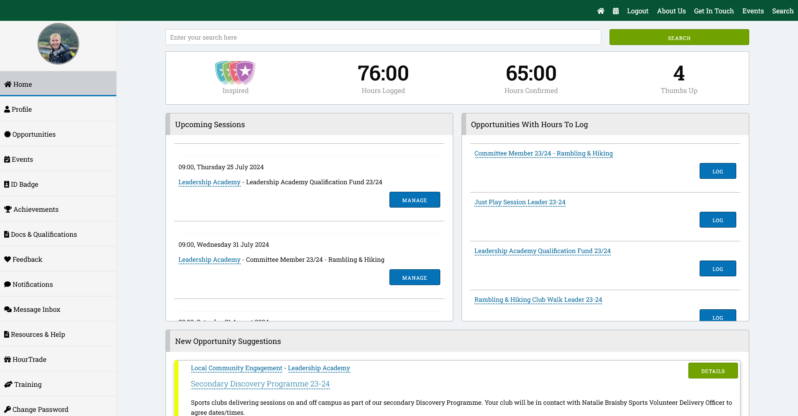
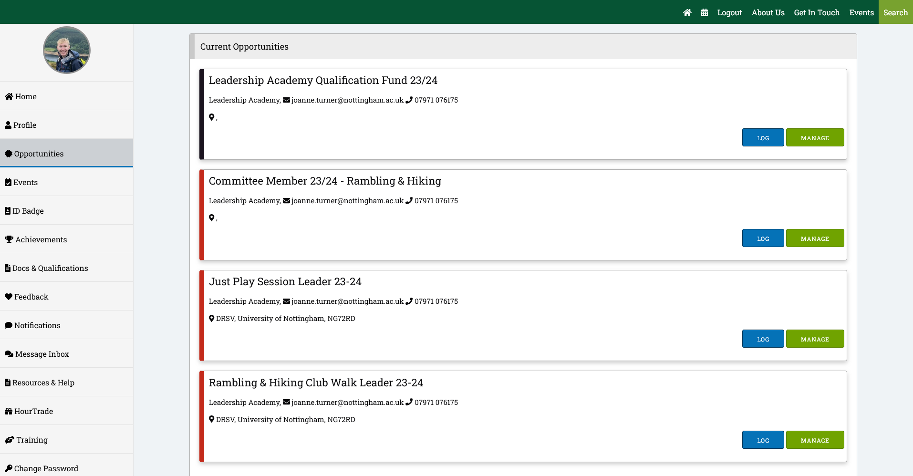
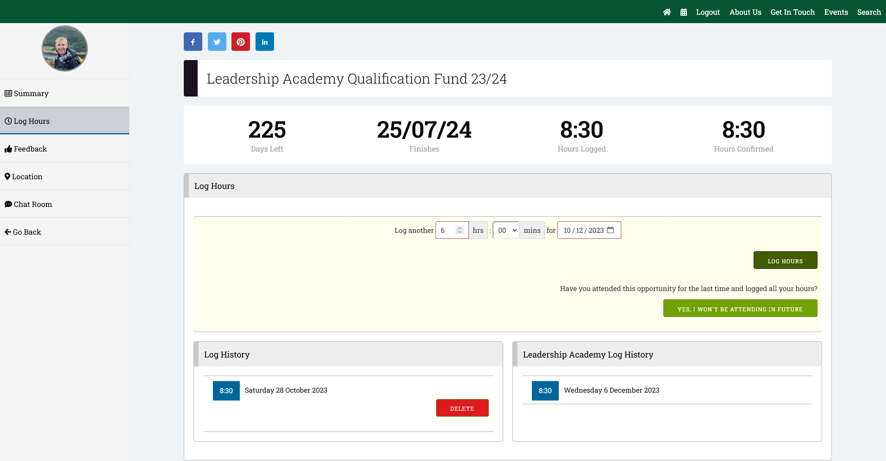

As part of volunteering your time with the club, you're able to be rewarded for your time through the [University of Nottingham Sport Leadership Academy](https://uonsportleaders.com).

*Quick Links*
- [Hour Trade](#hour-trade)
- [Hour Conversion](#hour-conversion)
- [Site Usage](#site-usage)
  - [Site Registration](#site-registration)
  - [Joining the opportunity](#joining-the-opportunity)
  - [The dashboard](#the-dashboard)
  - [Claiming Hours](#claiming-hours)
  - [Claiming Swag](#claiming-swag)

## Hour Trade

- 15 Hours: UoN Sport Water Bottle
- 15 Hours: UoN Coffee Mug
- 20 Hours: Leadership Academy Sports Leader black long sleeved t-shirt
- 40 Hours: Leadership Academy Sports Leader grey jumper
- 45 Hours: UoN Black Joggers
- 50 Hours: Leadership Academy Sports Leader green hoodie
- 65 Hours: Sports Massage Voucher

## Hour Conversion


| Activity     | Hours Claim | Notes                                |
|--------------|-------------|--------------------------------------|
| G2 Leading   | 6           | 5.5 hours walking with .5 hours prep |
| G2 Assessing | 6.5         | 5.5 hours walking with 1 hour prep   |
| G2 Assessed  | 6.25        | 5.5 hours walking with .75 hour prep |
| G3 Leading   | 7.45        | 7 hours walking with .45 hour prep   |
| G3 Assessing | 8           | 7 hours walking with 1 hour prep     |
| G3 Assessed  | 8.5         | 7 hours walking, 1.5 hour prep       |
| FA G2        | 5.5         | 5.5 hours walking                    |
| FA G3        | 7           | 7 hours walking                      |
| Driver       |             | Complete journey (including breaks)  |
| G2 Training  | 14          | 10 hours practical, 4 hours theory   |
| G3 Training  | tbc         | tbc                                  |



*These are to be used only as a guide. If you do more, claim more! If you do less, you still sacrificed your time, so claim the suggested amount. If you did not volunteer/lead, you are unable to claim hours.*

## Site Usage

It is recommended you use a computer to access the site.

### Site Registration

- Registration can be completed by going to [uonsportleaders.com/index?newRegistration=true](https://uonsportleaders.com/index?newRegistration=true). Follow the instructions to create a new account, using your university email and information. This is important so staff can verify you're a student. Once account is verified, log into the account. You will be a volunteer

### Joining the opportunity

Whilst logged in, join either:

- **2023/2024 Walk Leader, First Aid, and Minibus driver** - [Leadership Academy Qualification Fund 23/24](https://uonsportleaders.com/volunteers/opportunity/10201929)
- **Before 2023 Walk Leader, First Aid, and Minibus driver** - [Rambling & Hiking Club Walk Leader 23-24](https://uonsportleaders.com/volunteers/opportunity/10212225)

It is important you join the correct opportunity, otherwise the club will be charged for any training conducted.

### The dashboard

The above photo displays the dashboard. This can be accessed by pressing the 🏠(house) button any time.

### Claiming Hours

On your inital claim, you will have to rate the opportunity. Please leave positive feedback!

1. Go to the `Opportunities` section on the [dashboard](#the-dashboard). Then click `MANAGE` for your desired opportunity. 
   
2. Go to `Log Hours` and enter the amount of hours you have completed on said date. Then click `LOG HOURS`. Bare in mind, once clicking the `LOG HOURS` button, the `Hours Logged` counter will increase. It is common to not think the action has been successful, so only press the button once. 
3. Once hours are logged you are done. Hours get confirmed every month or so.

### Claiming Swag

1. Go to the `HourTrade` section.
2. Select what swag you would like. Our opportunities are classed as `Internal hours`. [Easy View](#hour-conversion)
3. Once claimed, your hours available for trade will decrease and UoN Sport will be in contact with you.

Any issues or queries, please dont hesitate to get in touch with us!