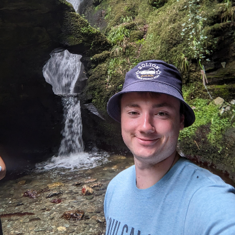
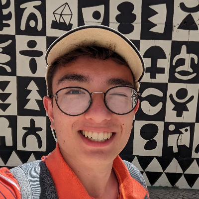
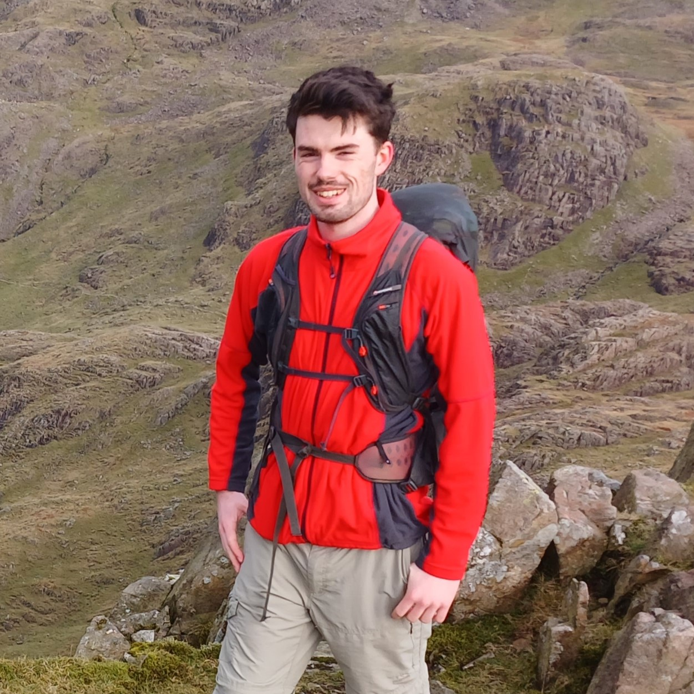

---  
menu:
    main:
        name: Elections
title: Elections
---

Elections for Vice President are now open! These close **12:00 on Friday 1st December**. Voting is done via [su.nottingham.ac.uk/elections](https://su.nottingham.ac.uk/elections).

Hustings will be happening at **19:00 on Monday 27th**. You'll be able to hear their speaches and ask questions. Teams link will be distributed via email.

Due to current technical difficulties, not all manifestos are being displayed correctly on the unions website. For up to date candidates please see the content below.

---
## Lewis Wilson 

### About Me

- I am a fourth year Civil Engineering student, recently returning from my year in industry where I was based back home in Warrington.
- I have enjoyed hiking with friends and family for many years, setting myself challenges such as climbing Snowdon four times across one weekend and completing a 105-mile route from coast to coast over seven days.
- I joined RamSoc in my second year to pursue my love for hiking and have thoroughly enjoyed being part of an incredible community. Since joining I have made memories for life and shared some unbelievable adventures with like-minded and down to earth individuals.

### Motivations

- After spending a year with the club, I made it a goal of mine to become part of the committee before completing my studies in 2025, and when the opportunity to become Vice President presented itself, I knew it was something not to pass up.
- I would also like to develop my leadership, teamwork, and interpersonal skills which I feel that I was lacking in pre-university. I volunteered at my local Cub group whilst on placement and have recently become a qualified G2 leader on our Sunday walks. Becoming Vice President and taking charge of the planning for the weekends away and Dark Peak Marathon is a further step in the right direction for me in developing these skills.
- Another motivation of mine is to provide much needed support to our amazing committee members who sacrifice a lot of their time to ensure that the club remains in a strong position.

### Why I Should be Voted in as Vice President

- Having taken the initiative to successfully plan and execute hiking trips with friends over the years, I feel that I would be a strong candidate for this position. This includes the coast-to-coast walk mentioned above where I planned the route we would take, taking into consideration where to camp, where to get food and water, and other logistics involved in the trip, as well as ensuring me and my friend had adequate kit.
- Earlier this year I went solo travelling around Scotland for a week and my ability to plan and stick to timings helped me to get the maximum number of experiences out of the trip. These skills will be transferable to the role and will help me excel in it.
- Part of my strategy as Vice President will be to seek feedback from members of the society and use this to make the next weekend trip even better. I would also give members more of a say in what meals will be provided on weekends away.
- If I was to be voted in as Vice President, my goal would be to plan weekends away and the DPM months in advance and to deliver the best experience possible for our members.

---
## Simon Beatie

Hello my name is Simon Beattie and I am a first year studying electronic engineering. I am putting myself forwards for vice president because after missing out on this society for a year and now having an incredible time with the society, making new friends and getting to ramble about with everyone, I don't want other students to miss out on such enriching experiences like I did, not only going rambles and hikes but crafting life long memories.

By using my outgoing and enthusiastic character I believe I can achieve the goal of getting more students into the society and on events. Furthermore my commitment is beyond just increasing numbers for the society but I aim to create a truly welcoming atmosphere beyond just trails where everyone feels valued and supported. I want to go beyond the surface and ensure that our society continues as a place where lasting memories are crafted, each member can find a sense of belonging.
Thank you for reading my manifesto, I look forward to the opportunity to contribute to the continued success of our Rambling and Hiking Society.
Simon

---
## Caleb Newman

### An introduction to myself

Hi, my name is Caleb. I’m a fourth year Industrial Economics student and I joined RAMSOC this year.

I have loved hiking since about the age of 6, when I joined Scouts as a Beaver. We often went on walks around the Northamptonshire countryside I grew up in. The longest being a 26 mile hike I completed with my Explorer Scout group.

After I turned 18, I helped establish and lead a new Explorer Scout Group in the village of Long Buckby which, to my knowledge, is still running to this day.

As well as Scouts, I hiked and wild camped in the Lake District and Snowdonia during my Gold DofE expeditions. I have also camped in the Peak District with mates from my home town.

### Why I want to run for Vice President

I want to run for Vice President because I have seen how hard everyone works to ensure this society runs smoothly and that everyone has a good time. So, I want to do my bit by taking on more responsibility and helping out with admin & planning, so that others have less to worry about on weekends away etc.

Another reason why I want to run for Vice President is because it sounds like a rewarding experience. So far, I have had a lot of fun driving the minibuses for the society and I’d like to get more involved. Becoming Vice President would also be a good opportunity for me to develop my leadership skills.

### What I can bring to the role

I can bring a fun, enthusiastic attitude to this role, as well as leadership and administration experience. As a Scout leader, I helped plan and organise hikes and other activities for 14-18 year olds whilst also being responsible for safeguarding.

During my placement year in global credit risk, I helped administer over $500 million of credit for over 100+ customers across the world. Additionally, I was elected head boy of my secondary school.

These experiences helped me develop team-working, communication, decision making and organisational skills, as well as teaching me how to be assertive and keep calm under pressure.

Also, I worked at McDonald’s for around 4 years, so you won’t get food poisoning on a weekend away if you vote for me 😉

### What I want to achieve in the role

If elected, I want to ensure that everything I am responsible for runs smoothly, and that everyone has a good time and feels included. So, I want to increase the amount of positive feedback from the events I’ll be organising if elected.

### Why I should be elected into the role

I should be elected as Vice President because it is a natural progression from the roles I have had previously outside of RAMSOC, and I have the skills and enthusiasm required to succeed.

---

For any questions or queries about elections, please don't hesitate to get in touch with us!