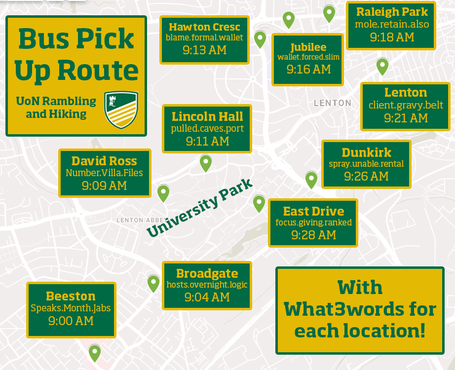

---  
menu:
    main:
        name: F&Q
title: Frequently Asked Questions
---



For the Sunday hikes we provide transport for you to and from the location of the hike. Please see below the timings and location of the bus stops. **ARRIVE 5 MINUTES BEFORE TIMINGS**
1. 09:00 - [Speaks.Month.Jabs](https://what3words.com/speaks.month.jabs)  | Tesco Extra taxi rank in Beeston
2. 09:04 - [Hosts.Overnight.Logic](https://what3words.com/hosts.overnight.logic) | Broadgate Park
3. 09:09 - [Number.Villa.Files](https://what3words.com/number.villa.files) | David Ross Sports Village
4. 09:11 - [Pulled.Caves.Port](https://what3words.com/pulled.caves.port) | Lincoln Hall
5. 09:13 - [Blame.Formal.Wallet](https://what3words.com/blame.formal.wallet) | Hawton Cresc (For Wollaton)
6. 09:16 - [Wallet.Forced.Slim](https://what3words.com/wallet.forced.slim) | Jubilee
7. 09:18 - [Mole.Retain.Also](https://what3words.com/mole.retain.also) | Raleigh Park
8. 09:21 - [Client.Gravy.Belt](https://what3words.com/client.gravy.belt) | Willoughby Avenue (For Lenton)
9. 09:26 - [Spray.Unable.Rental](https://what3words.com/spray.unable.rental) | University East Entrance Bus Stop (Dunkirk) 
10. 09:28 - [Focus.Giving.Ranked](https://what3words.com/focus.giving.ranked) | East Drive Bus Stop



Yes, of course! You'll have to catch the first hopper bus, as this will get into park campus just before we leave. There are a few SB students who attend our events, with some of them driving. So pop us an email, or message us on social media and we can point you in the right direction!


We charge each member a £20 fee. This helps us cover the cost of kit, and help subsidise some of the events. Prices for walks are set based on the cost of travel, with the average walk for members costing £13 and £18 for non-members.

