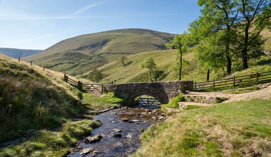
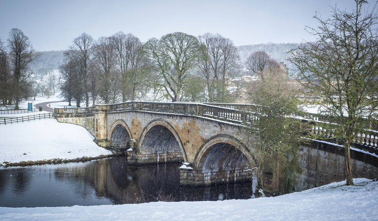



Merry Christmas and welcome to Ramsoc’s final walk of the term! Our walks today will
explore the countryside surrounding the picturesque historic market town of Bakewell in
what is known as the ‘White Peak’, a gently rolling limestone plateau dissected by beautiful
dales. Bakewell is famous for its tarts and puddings, and we recommend you reward yourself
with a visit to the bakery at the end of the walk!
We are offering up to 4 walks today, ranging in length and difficulty, which are described below.
Walks 1 and 2 are ideal for those new to hiking or enjoy a social, slow-paced walk with plenty of photo
opportunities (and a bit longer in Bakewell).
Walks 3 and 4 are more challenging, covering more distance and ascent. They require a faster walking pace
with fewer stops.





{}

## Manners Wood

Walk 1 begins at the Bakewell Agricultural Business Centre (SK 221
684). Follow the footpath southeast along the hedgerow for 1.75km,
handrailing with the River Wye on the right. At the junction with
the track, bear left and follow it up the hill as it bends sharply above
an old railway tunnel. Stay on the bridleway as it veers a sharp right
off the track and across fields, with Haddon Hall down on the right.
Follow the bridleway as it turns left along a walled track, over a
junction and uphill past the entrance to Bowling Green Farm. Follow
the road downhill, keeping left at the junction, until it reaches a
track junction at the southern edge of Manners Wood (SK 243
670). Here, take the bridleway ahead uphill into Manners Wood.
Follow the bridleway up this steep section for 500m until the
junction with the Haddon estate concession path (SK 244 673).
Here turn left and follow the concession path for 1.5km and keep
left at the fork. Follow the path until it reaches a stream in a small
gully (SK 230 687), cross it and turn left. The path descends through
a golf course where it bears right and crosses a bridge above the
Monsal Trail and down the field beyond and onto a gated lane. Turn
right at the junction with Coombes Road. At the end of the road
turn left and cross Bakewell Bridge, finishing the walk at The Red
Lion (SK 217 685).

        

{}

{}

## Chatsworth Park

Walk 2 begins at the Bakewell Agricultural Business Centre (SK 221
684). Follow the footpath that skirts around the business centre,
and turn right down Coombes Road. Take the first left, up a gated
lane. Follow it through a field where it bears right across a bridge
above the Monsal Trail and through a golf course. The route briefly
enters Manners Wood, continuing straight along the footpath.
Exiting the woodland, follow the footpath for 1.5km through the
fields, continuing straight at the crossroads by the pond, until a
sharp right turn at the crossroads near Carlton Houses (SK 247
687). Descend down the path, keeping left, past Carlton Houses and
follow the bridleway beside a stream for 1.25km until it reaches
Carlton Lees. At the junction follow the left bend and follow it past
Chatsworth Garden Centre and enter Chatsworth Park. Cross the
B6012 and follow the first path that bears right towards the ruin of
Chatsworth Mill. Follow the path alongside the River Derwent for
1.5km, passing two weirs and fabulous views of Chatsworth House,
until the route reaches Paine’s Bridge (SK 257 701). Here, turn left
and follow the footpath that curves right towards Edensor. Cross
the B6012 and follow the lane for 1.75km, which begins in the village
before climbing a steep hill. At the junction, turn left and follow the
road for 750m until it reaches the woods. Here, take the footpath
that descends through the woods. The footpath reemerges at
Station Road, follow the road into Bakewell and across Bakewell
Bridge, finishing the walk at The Red Lion (SK 217 685).

{}

{}

## Lathkill Dale and Magpie Mine

Walk 3 begins at the Bakewell Agricultural Business Centre (SK 221
684). Cross the footbridge to Smith’s Island, and another onto
Grandby Croft. Immediately turn left, walk along the river, and cut
across recreation ground. At the A6 turn left and follow it for
500m. Cross the A6 and turn right down Intake Lane and follow it
for 1.25km. At the end of the lane, turn left and then shortly turn
right down New Close Lane. After 500m, bear left and follow the
footpath through the fields and into Over Haddon. Follow the road
through the village and at the grass triangle turn left down the
twisting lane to the bottom of Lathkill Dale. Follow the permissive
footpath along the River Lathkill for 2km, passing Bateman’s House.
At the exit of Palmerston Wood at Carter’s Mill (SK 183 657), turn
right and follow the footpath that climbs out the valley. Cross the
road and follow the footpath across the field. Turn right and briefly
follow the B5055. Turn left down Green Lane, bear left at the end
of the lane and follow the road as it bears left for 1km. Turn right
along the track to Magpie Mine (SK 172 681). At Magpie Mine,
follow the path that bears right and follow it for 1km. At the road
turn right and follow it to the junction, where the route turns left.
Shortly after, take the lane that bears right and follow it for 750m.
When the road curves to the right, continue straight down the
footpath. Cross the A6 and cross the bridge into Ashford in the
Water, turn right past the church and cross the A6020. Follow a
small lane that crosses the River Wye, then immediately turn left
and follow the footpath by the river for 1.25km. At the A6, turn left
and follow it for 1.25km into Bakewell, finishing the walk at The Red
Lion (SK 217 685).

{}

{}

## – Manners Wood and Chatsworth Park

Walk 4 begins at the Bakewell Agricultural Business Centre (SK 221
684). Cross the footbridge to Smith’s Island and immediately turn
right down the road. At the junction, turn left down Coombes Road
then immediately turn right up Station Street. After crossing over
the bridge above the Monsal Trail, bear right and ascend up the
footpath through the woods. Immediately turn right down the track
once exiting the woods, and follow it for 1km. At the crossroads by
the pond, turn left and follow the path through fields for 1.5km.
Turn left at the crossroads near Carlton Houses (SK 247 687).
Follow the walled bridleway through the woods. After entering
Chatsworth Park, continue straight along the footpath as the
bridleway veers to the right. Follow the footpath for 1km, aiming
for the spire of the church in Edensor. Entering Edensor, turn right
and follow the road through the village. Cross the B6012 and follow
the footpath that curves right towards Chatsworth House. At
Paine’s Bridge (SK 257 701), turn right and follow the path alongside
the River Derwent for 1.5km, bearing left at the fork, passing
fabulous views of Chatsworth House and two weirs. At the ruin of
Chatsworth Mill, turn right and cross the B6012. Follow the road
past Chatsworth Garden Centre, and after the road curves right,
turn left. Follow the Derwent Valley Heritage Way for 2.5km to
Rowsley. Turn right up Church Lane and follow the bridleway up
the hill and through the woods for 1.75km. Turn right at the track
junction at the southern edge of Manners Wood (SK 243 670), take
the bridleway uphill into Manners Wood. Follow the bridleway up
this steep section for 500m until the junction with the Haddon
estate concession path (SK 244 673). Here turn left and follow the
concession path for 1.5km and keep left at the fork. Follow the path
until it reaches a stream in a small gully (SK 230 687), cross it and
turn left. The path descends through a golf course where it bears
right and crosses a bridge above the Monsal Trail and down the field
beyond and onto a gated lane. Turn right at the junction with
Coombes Road. At the end of the road turn left and cross Bakewell
Bridge, finishing the walk at The Red Lion (SK 217 685).

{}



